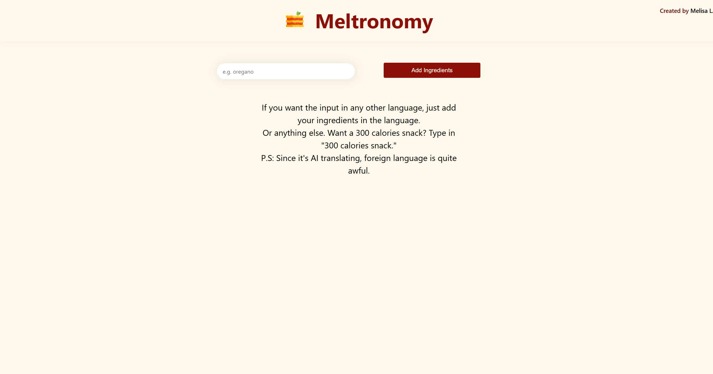
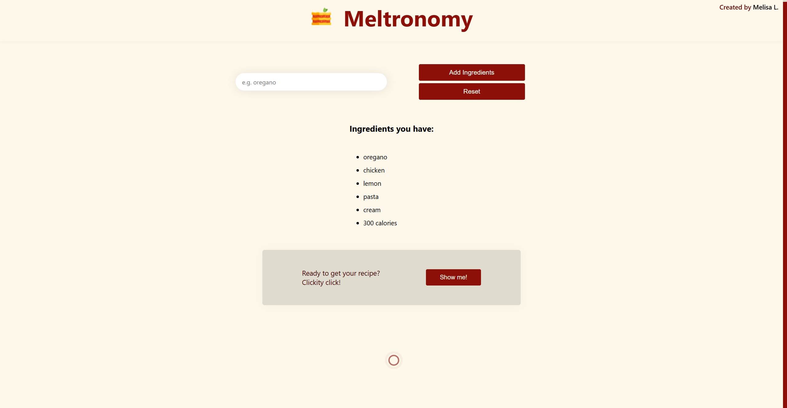
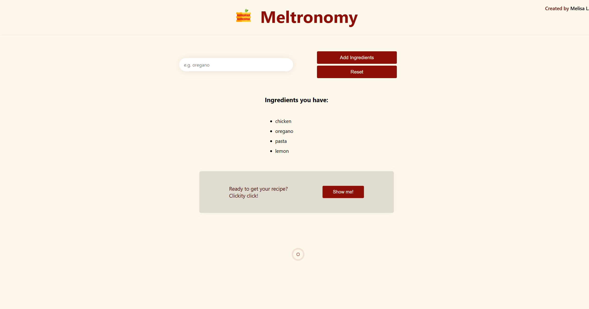
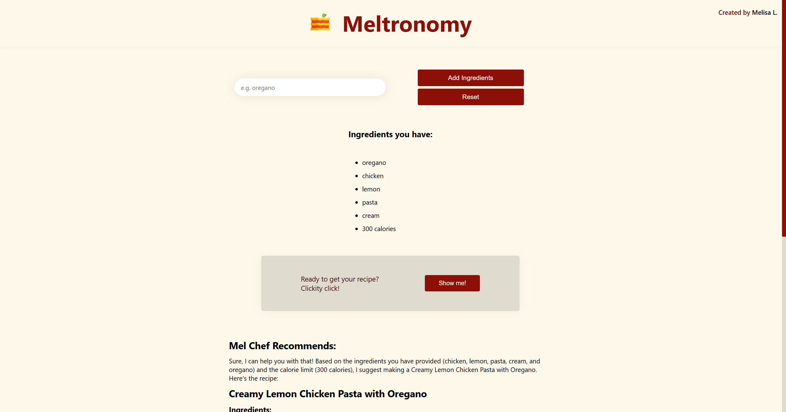
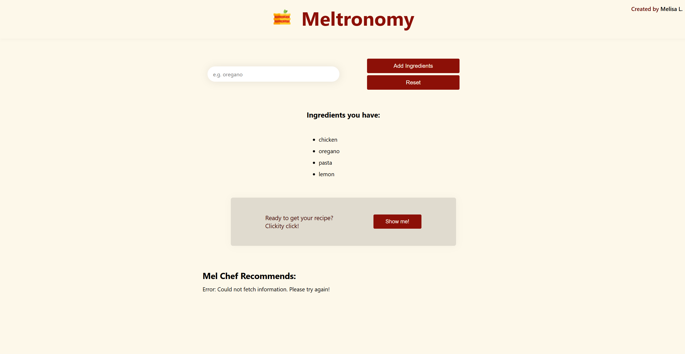
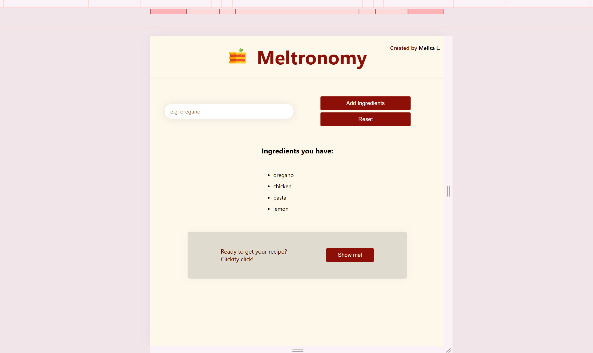
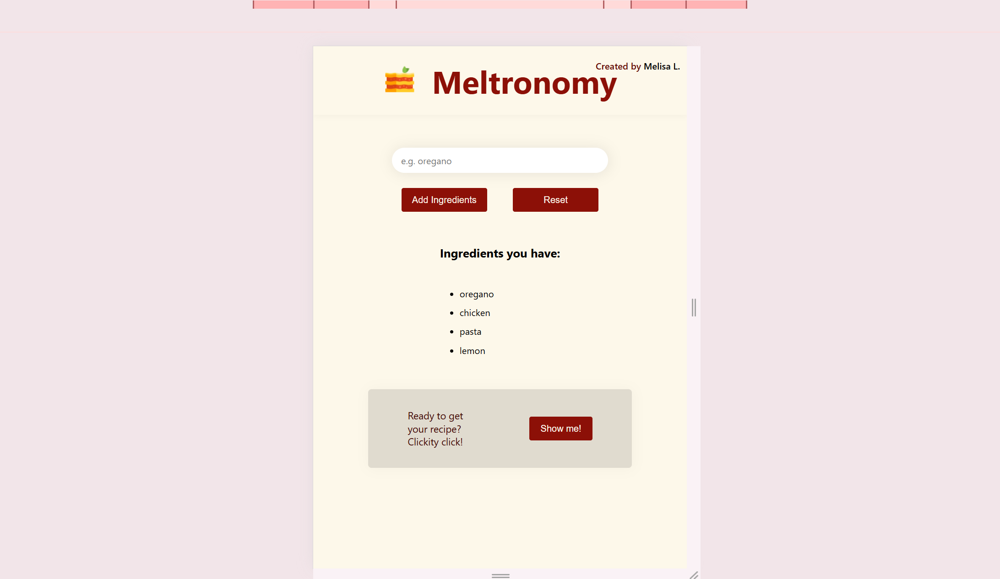
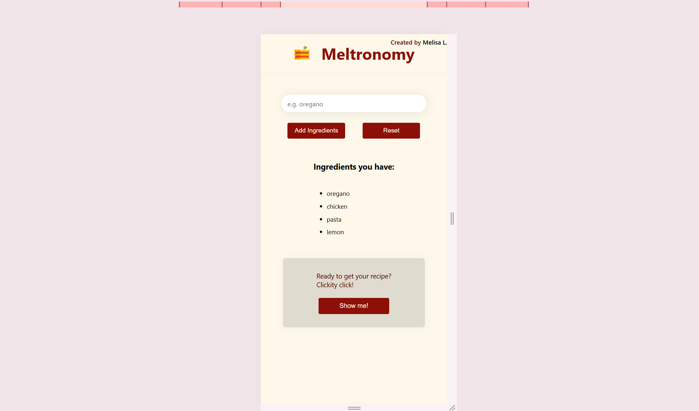
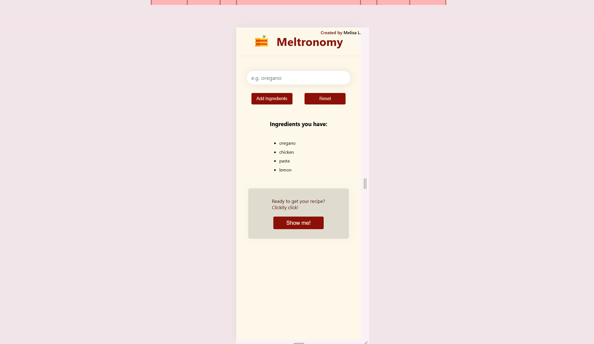

# Meltronomy

AI-powered recipe generator built with **React**. Add ingredients, reset your list, and instantly generate custom recipes via the **Mistral AI API**.

---

## Features

> **Responsive Layout** – Built with CSS for a clean, mobile-first experience.  

> **Loading States** – Smooth UX with spinners while fetching recipes from the API.  

> **Reusable Components** – Modular React components (`InputBox`, `IngredientsList`, `RecipeBox`) for clarity and maintainability.  

> **Dynamic State Management** – Leveraged React `useState` with lifted state in the `Main` component to track ingredients, recipe text, and UI flow.  

> **Conditional Rendering** – Warnings, reset buttons, and recipe displays adapt based on context.  

> **Mistral AI API** – Recipes generated by an external AI model.  

> **Safe HTML Rendering** – Used DOMPurify to sanitize AI-generated output before injecting into the DOM.  

---

### UI Preview

> Example screens to give you a sense of the app:

- **Ingredient Input** – enter items and build your list.  
- **Recipe Generation** – recipes displayed after API call.  
- **Reset State** – clear list and start over with a single click.  
- **Error Handling** – clear messages if something goes wrong.  

(Screenshots are below.)

---

## Screenshots 

Input screen. Reset button and get recipe boxes are not shown until there is input.

Get recipe box is shown after adding a few inputs, and spinner is set in motion until something is displayed below.

Fetching recipe.

Error mesage being displayed.

## Responsive Design
For tablets, smaller laptops

For smaller tablets, large phones

For medium phones

For small phones

